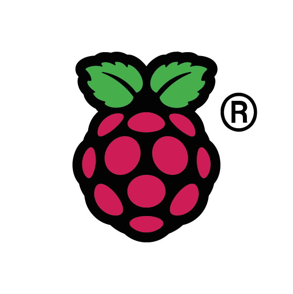
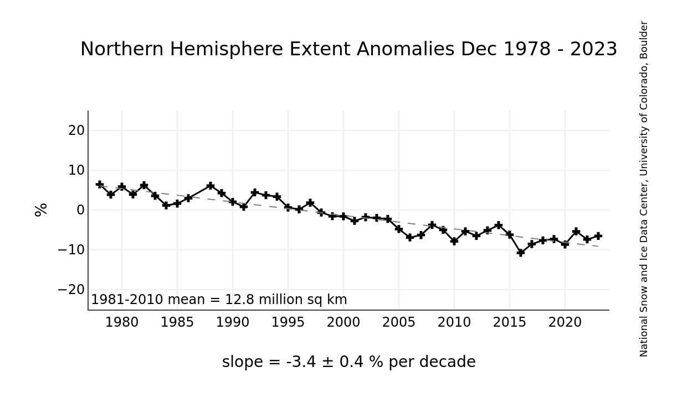

# Seal Coin (SEAL)

<table align="center" border="0">
<tr>
<td></td>
<td></td>
</tr>
</table>

The goal of this project is to explore with IOT and
[Soroban](https://soroban.stellar.org) - Stellar Smart Contract, by creating a token with additional
features.

[Stellar](https://stellar.org) is one of the most used blockchain technology.
It offers concrete real world applications such as ease of cross border
payments, tokenization of real world assets. Since January 2024, things are
getting even better with the ability to write Smart Contracts. In the Stellar
ecosystem, these are called *Soroban contracts*. 

## Rational

### Seal

These beautiful creatures are sadly endangered. One of their main threat is
the melting of ice. Ice is paramount to their survival as they rely on it for
breeding, forage for food or even hide from other predators like polar bears.

### Sea Ice Extent

> The daily Sea Ice Index provides a quick look at Arctic-wide changes in
sea ice. It provides consistently processed daily ice extent and concentration
images and data since 1979. Daily extent [is compared] with an outline of the
typical extent for that day based on a 30-year (1981-2010) median.
https://nsidc.org/data/seaice_index
https://nsidc.org/sites/default/files/g02135-v003-userguide_1_1.pdf



### Seal Coin

Seal Coin (SEAL)'s purpose is to raise awareness around the ice extent decline
in the Arctic.

1,000,000,000 SEAL are initially minted. The supply is directly linked to
a volume of liquid stored in a container. Burning SEAL removes liquid,
while minting SEAL add liquid to the container. The liquid is the token itself.

Fetching the current volume of liquid in the container constitute
a proof-of-reserve.

The supply is regulated via manual action and by
following the ice extent in the Arctic. Once a day, the current ice extent is
compared to the 30-years median ice extent of the day.
If the extent increases, the supply increases. If the extent decreases,
the supply decreases.

The increase or decrease is caped at 500,000,000. Hence, at most there can
be up to 1,500,000,000 SEAL and even if the ice extent goes to 0, the minimal
supply will be 500,000,000 SEAL.

The exact amount of token which is burned/minted is:

```
(sea_ice_extent - median_extent) * 100
# e.g sea_ice_extent = 13976, median_extent = 14526
# 13976-14526 = -550
# -550 * 100 = -55k SEAL
```

At a typical deviation of -3-4% on a given day, this leads to a constant burn
of 50K SEAL for the next 10K days (or ~27 years). Which is set to corresponds
to the foreseen total recession of the ice extent by experts by the year 2040.

The deflationary nature based on the bad outcome that the ice is melting is
intended. 100,000,000 SEAL are reserved to support the outreach mission of
the project. The worse the situation is, the more valuable SEAL will become and
be available to support the challenges we are facing.

## Token supply management

The token lifecycle is handled via a Raspberry Pi. The Pi's responsibilities
are:

1. Getting the daily extent,
2. Adjust the off-chain supply,
3. Adjust the on-chain supply (mint/burn token),
4. Provide a proof-of-reserve.

### Structure
There are 2 folders:

- *iot*: relates to the client side, Raspberry Pi code.
- *contract*: the Soroban contract itself.

In each folder, there is a handy Makefile with useful commands. Let's go
through the IOT part first, and then we will cover the contract.

### Raspberry Pi

...

#### Hardware

I am using a Raspberry Pi Zero 2 W. BOM:

- Raspberry Pi Zero 2 W
- Button (x2)
- BLUE LED (+1x 220 ohm resistance)
- RED LED (+1x 220 ohm resistance)
- Ultrasonic sensor HC-SR04 (+1x 220 and +1x 330 ohm resistances: 5V to 3V on the GPIO)
- Peristaltic pump 12V DC (+ 12V DC power supply)
- Adafruit TB6612 1.2A DC/Stepper Motor Driver Breakout Board
- E-Paper HAT 2.13" 250x122

_On
[measuring](https://new.abb.com/products/measurement-products/level/a-dozen-ways-to-measure-fluid-level)
fluid level.
[Some](https://www.seeedstudio.com/blog/2019/12/23/distance-sensors-types-and-selection-guide/)
common options for RPi. Other option with ToF sensor, e.g. VL53L1X or VL6180X_

See `iot/seal_coin_supply.py` for details on which GPIO to connect.


#### Python service

After a classical headless setup of the Raspberry Pi, install everything Python:
```bash
ssh grogu@pumpit -i .ssh/raspberrypi_zero
sudo apt-get install libopenblas-dev
cd iot
python -m venv venv
source venv/bin/activate
pip install .
# And some variables needed to run the Soroban contract:
# Hash of the contract and addresses of the issuing and distribution accounts
export CONTRACT_HASH=...
export ISSUER_ADDR_SECRET=...
export DISTRIBUTION_ADDR_SECRET=...
```

To run the client (provided the contract is initialized, see bellow):

```bash
python seal_coin_supply.py
```

Behind the scene, once a day, the ice extent is retrieved. Its value is
used to adjust the supply. As the physical supply of the token is changed,
a call to the Soroban contract is made to adjust the on-chain supply.

### Soroban - Stellar Smart Contract

We define a Smart Contract that ...

*Note: all commands are listed in a convenient Makefile in the contract folder.*

#### Setup
These steps are to be done on any machine, not the Pi(s).

Following the Soroban [doc](https://soroban.stellar.org/docs), we setup a
Soroban local environment and install all dependencies. 
```bash
cd contract
# install Rust
curl --proto '=https' --tlsv1.2 -sSf https://sh.rustup.rs | sh
# install Soroban and config
rustup target add wasm32-unknown-unknown
cargo install --locked soroban-cli --features opt
```

In the following, we will be using *testnet*. Another option for playing
around is to use a docker image to run an actual Stellar network locally.
It's very simple to do as they provide a ready-to-use
[image](https://hub.docker.com/r/stellar/quickstart).

```bash
soroban config network add --global testnet
	--rpc-url https://soroban-testnet.stellar.org:443
	--network-passphrase "Test SDF Network ; September 2015"
```

We create (at least) two accounts on testnet and add some funds (in XLM).
Here I have `mando` and `grogu`. `mando` will be used as the admin of the
contract, and it will also be the one giving up some of its funds to deposit
on the contract.

```bash
# generate addresses
soroban config identity generate grogu
soroban config identity generate mando
# and add funds
soroban config identity fund grogu --network testnet
soroban config identity fund mando --network testnet
mkdir -p .soroban
```

#### Creation of Seal Coin

We follow the extensive
[documentation](https://developers.stellar.org/docs/issuing-assets/how-to-issue-an-asset)
to issue the new asset on the Stellar blockchain.

At the end of the process, we have an issuing account and a distribution account,
which hold the 1,000,000,000 Seal Coin (SEAL).

# What's next!?

This is a simple example, yet it showcase how a simple concept can be used in
a somehow real application. There are a few nice-things we can do to play
around the idea:

- Use a hardware security module (e.g. Zymbit) so that we provide additional
  guarantees about the off-chain setup.
- Use a different liquid. Kerosene could be interesting as it's blue-ish and
  if we burn token we can actually burn them for real.
- Deal with liquid... Evaporation, etc. Can use RC car/plane fuel tanks.
- Allow a decentralized supply. Nodes could replicate this setup and each would
  share the supply. (Bring lots of other issues to prevent people to temper
  with the off-chain data.)
- Make an ICO system. We can mint tokens and sell them at a given price
  prevent any sell/buy before certain conditions are met.
- Use other metrics to regulate the supply.
- Restrict operations depending on conditions. E.g. if the extent goes bellow
  a specific value, disable trading.

Feel free to raise any issues or even make PRs! Also, if you think we should
launch that for real, let's talk :wink:
